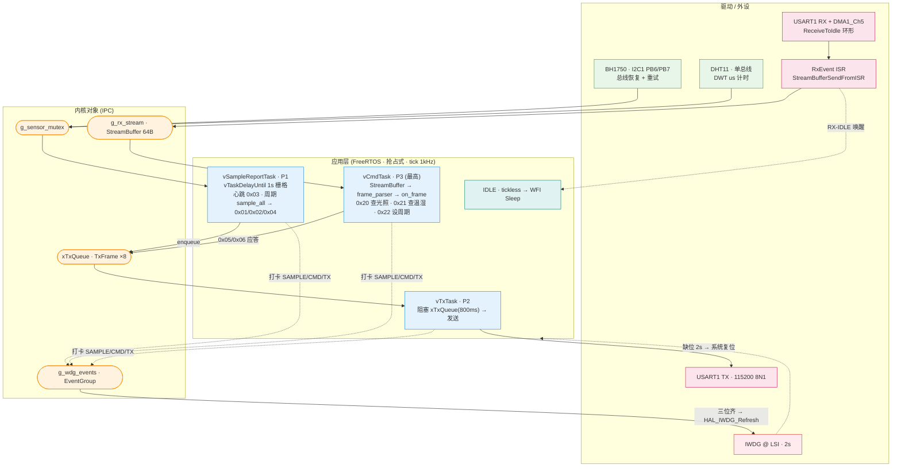

# STM32 FreeRTOS 传感节点

> 在 STM32F103 上用**原生 FreeRTOS**(手动移植 ARM_CM3 端口)搭的多协议传感节点:采集 DHT11 / BH1750,经 USART1 以自定义二进制帧与[边缘网关](https://github.com/manbaaa-out/embedded-edge-gateway)**双向**通信 —— 周期上报 + 秒级响应下行命令,并叠加**事件组「全员报到」看门狗**与 **tickless 低功耗(Sleep)**。


-44883E)


```
        ┌──────── 上行:温湿度 / 光照 / 状态 / 心跳 ────────▶
DHT11 ┐                                                       网关
BH1750┘  STM32F103 · FreeRTOS                              (Raspberry Pi)
        ◀──────── 下行:查询 / 设周期(带 seq + ACK)────────┘
```

## 目录

- [特性](#特性)
- [硬件与引脚](#硬件与引脚)
- [架构](#架构)
- [任务模型](#任务模型)
- [串口帧协议](#串口帧协议)
- [看门狗:事件组「全员报到」](#看门狗事件组全员报到)
- [低功耗:tickless Sleep](#低功耗tickless-sleep)
- [构建与烧录](#构建与烧录)
- [调试与排障](#调试与排障)
- [目录结构](#目录结构)

## 特性

- **抢占式多任务** — 命令(P3)> 发送(P2)> 采样上报(P1)三任务分工,经队列 / 流缓冲 / 互斥量解耦,无共享态裸奔。
- **双向协议** — 上行温湿度 / 光照 / 状态 / 心跳;下行查询(0x20/0x21)与设采样周期(0x22),均带 `seq` + 应答(0x05 查询应答 / 0x06 ACK),同 seq 幂等。
- **零拷贝接收** — USART1 `ReceiveToIdle + DMA` 环形收,RX-IDLE 中断把字节 `FromISR` 灌进流缓冲唤醒命令任务 —— 不丢帧、不轮询。
- **健壮外设** — BH1750 I²C 失败自动**总线恢复**(DeInit → 手动钟脉冲 → 重 init)后重试;DHT11 单总线用 DWT 周期计数器做 µs 级时序与超时。
- **全员报到看门狗** — IWDG 2s,只有三任务在一轮内**各自打卡集齐**才喂狗;任一任务卡死即放任复位,杜绝「主循环活着但某任务僵死」的假活。
- **tickless 低功耗** — 空闲即 `WFI` 进 Sleep,睡前停 TIM4 时基、醒后恢复;UART 可秒级唤醒并完整响应命令,且与 IWDG 不冲突。
- **零警告** — `-Wall -Wextra` 下 0 warning。

## 硬件与引脚

| 外设 | 引脚 | 说明 |
|---|---|---|
| 调试串口 USART1 | PA9 (TX) / PA10 (RX) | 115200 8N1,接网关(USB-TTL / 树莓派 UART) |
| BH1750 光照 | I²C1:PB6 (SCL) / PB7 (SDA) | 需 4.7kΩ 上拉;失败自动总线恢复 |
| DHT11 温湿度 | 单总线 `DHT11_Pin`(GPIO) | DWT µs 计时,临界区内读 |
| IWDG | — | LSI 40kHz,Prescaler 64 / Reload 1250 ≈ **2.0s** |
| 时钟 | HSE + PLL = **72MHz**;LSI = 40kHz(喂 IWDG) | |

> ⚠ 3.3V TTL 电平,切勿接 5V / RS232。

## 架构



## 任务模型

| 任务 | 优先级 | 阻塞点 | 职责 |
|---|---|---|---|
| `vCmdTask` | 3(最高) | `xStreamBufferReceive`(800ms 超时) | 解析下行帧 → `on_frame` 分发 0x20/0x21/0x22,组应答投 `xTxQueue`;同 `seq` 幂等重发 |
| `vTxTask` | 2 | `xQueueReceive`(800ms 超时) | 从 `xTxQueue` 取帧 → `HAL_UART_Transmit` 串行发送(单一发送者) |
| `vSampleReportTask` | 1 | `vTaskDelayUntil`(1s 绝对栅格) | 1s 心跳 0x03;每 `g_sample_period_ms` 采一轮 → 0x01/0x02/0x04;并驱动喂狗判定 |
| `IDLE` | 0 | `WFI` | tickless 空闲睡眠 |

三个任务都用「超时唤醒」而非永久阻塞,保证即使没业务也会**每 ≤1s 醒来打卡一次**,喂狗判定窗口稳定落在 IWDG 2s 内。

## 串口帧协议

与网关共用一套帧格式 `AA 55 | LEN | TYPE | payload… | CRC16_LO CRC16_HI`,CRC16-MODBUS(多项式 `0xA001`,初值 `0xFFFF`),覆盖 `LEN..payload`;`LEN = 1 + len(payload)`(含 TYPE)。

| 方向 | TYPE | 含义 | payload |
|---|---|---|---|
| 上行 | `0x01` | 温湿度 | 温×10、湿×10(各 2B 大端)+ 校验位 |
| 上行 | `0x02` | 光照 | 光照 lux(2B 大端) |
| 上行 | `0x03` | 心跳(1s) | 无(不落库) |
| 上行 | `0x04` | 设备状态 | bitmask:bit0=DHT11 OK,bit1=BH1750 OK |
| 应答 | `0x05` | 查询应答 | `seq` + `rc` + 数据 |
| 应答 | `0x06` | 命令 ACK | `seq` + `rc` |
| 下行 | `0x20` | 查光照 | `seq` |
| 下行 | `0x21` | 查温湿度 | `seq` |
| 下行 | `0x22` | 设采样周期 | `seq` + 周期秒数(2B 大端 uint16) |

## 看门狗:事件组「全员报到」

IWDG 一旦启动便不可关停 —— 关键在于**谁有资格喂它**。本节点不在单点喂狗,而是给三任务各分配一个事件位(`WDG_BIT_SAMPLE/CMD/TX`):每个任务在自己的循环里 `xEventGroupSetBits` 打卡,只有 `vSampleReportTask` 发现**三位集齐**时才 `HAL_IWDG_Refresh` 并清零、开启下一轮。任一任务僵死(再不打卡)→ 集不齐 → 2s 后 IWDG 复位。这样看门狗监督的是「全员都活着」,而非「主循环还在转」。

## 低功耗:tickless Sleep

`configUSE_TICKLESS_IDLE=1` 后,空闲任务自动 `WFI` 进 Sleep(仅关 CPU 时钟,外设照常)。两点适配均在 `FreeRTOSConfig.h` 钩子里,**不改 `port.c`**:

- `configPRE/POST_SLEEP_PROCESSING` 睡前 `HAL_SuspendTick()` 停 TIM4 时基(它是 1kHz 唤醒源、不停会每 1ms 吵醒 CPU),醒后 `HAL_ResumeTick()` 恢复。
- 调试期 `__HAL_DBGMCU_FREEZE_IWDG/TIM4()` 冻结计数,避免断点暂停被看门狗复位(F1 的 DBGMCU 常通,无需 `__HAL_RCC_DBGMCU_CLK_ENABLE`)。

实测:空闲时核稳定停在 `WFI`;UART 命令秒级唤醒并回完整 0x05;静置 14s IWDG 不误复位(`RCC_CSR.IWDGRSTF=0`),tick 计数随睡眠正确补记。更深的 STOP/STANDBY 在「随时响应命令 + 1s 心跳 + 2s 看门狗」前提下不划算(F1 的 USART 无法从 STOP 唤醒),故止步 Sleep。

## 构建与烧录

```bash
# 配置 + 编译(Ninja + arm-none-eabi-gcc,产物在 build/Debug/)
cmake --preset Debug
cmake --build build/Debug

# 烧录(ST-Link/V2 + OpenOCD)
openocd -f interface/stlink.cfg -f target/stm32f1x.cfg \
  -c "program build/Debug/N6_freertos.elf verify reset exit"
```

## 调试与排障

本机不装 `st-flash`,烧录 / 探测统一用 **OpenOCD**;FreeRTOS 多任务卡死靠 **RTOS-aware gdb** 一眼定位:

```bash
# 查"哪个任务卡在哪":后台跑带 RTOS 感知的 openocd
openocd -f interface/stlink.cfg -f target/stm32f1x.cfg \
  -c "stm32f1x.cpu configure -rtos auto" -c init &
gdb-multiarch build/Debug/N6_freertos.elf \
  -ex "target extended-remote :3333" \
  -ex "info threads" -ex "thread apply all bt"   # 每个任务的阻塞点一目了然

# 看复位源:RCC_CSR@0x40021024(IWDGRSTF=bit29 / PINRSTF=bit26),RMVF=bit24 清标志
openocd -f interface/stlink.cfg -f target/stm32f1x.cfg \
  -c init -c "mdw 0x40021024" -c shutdown

# 把卡死 PC 映射回源码
arm-none-eabi-addr2line -f -i -e build/Debug/N6_freertos.elf 0x........
```

> 验证 Sleep:`halt` 后看 PC 是否停在 `vPortSuppressTicksAndSleep` 的 `wfi`;静置后 `RCC_CSR.IWDGRSTF` 仍为 0 即证明喂狗在睡眠期不踩线。

## 目录结构

```
N6_freertos/
├── Core/
│   ├── Inc/           # FreeRTOSConfig.h、外设/驱动头、main.h
│   └── Src/
│       ├── main.c                 # 任务创建 + on_frame/sample_all/report + RxEvent ISR
│       ├── frame_parser.c         # 收帧 FSM(逐字节,CRC16 校验)
│       ├── crc16.c                # CRC16-MODBUS 查表(与网关同源)
│       ├── bh1750.c / dht11.c     # 传感器驱动(含 I²C 总线恢复 / DWT 计时)
│       ├── dwt_delay.c            # DWT 周期计数 µs 延时
│       ├── iwdg.c / usart.c / dma.c / i2c.c / gpio.c   # CubeMX 外设
│       └── stm32f1xx_it.c         # 中断向量(SVC/PendSV/SysTick 让给 port.c)
├── cmake/             # arm-none-eabi 工具链 + FreeRTOS + CubeMX 片段
├── CMakeLists.txt / CMakePresets.json
└── *.ioc              # STM32CubeMX 工程
```

> FreeRTOS 内核源在仓库根的 `FreeRTOS-Kernel-main/`(ARM_CM3 端口)。配套网关见 [embedded-edge-gateway](https://github.com/manbaaa-out/embedded-edge-gateway)。

---

© 2026 manbaaa-out
